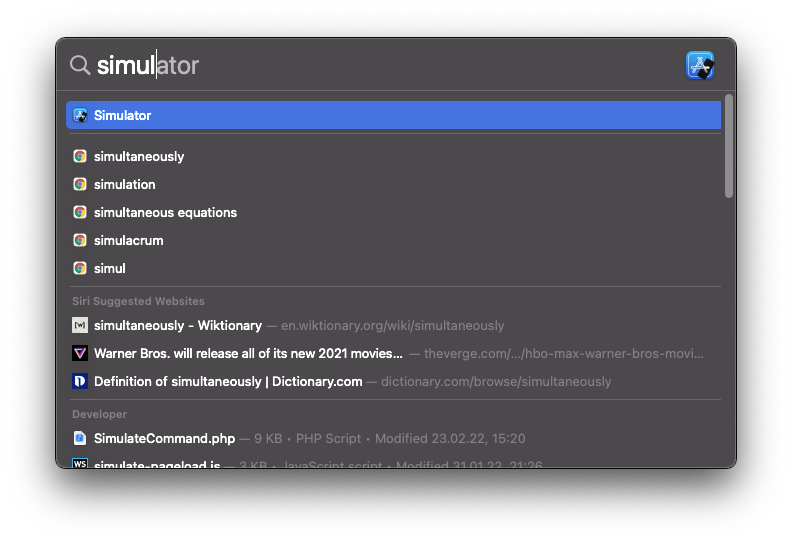
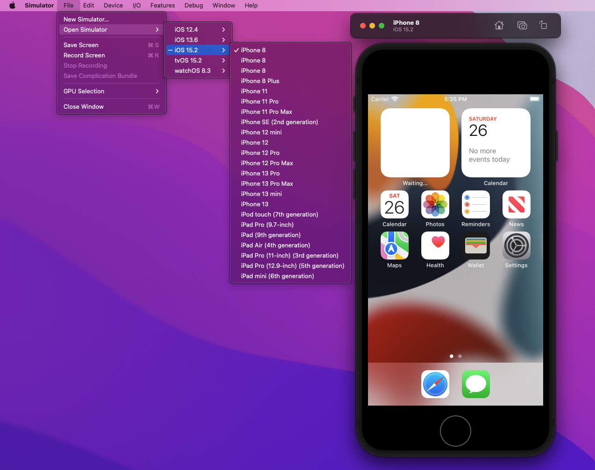
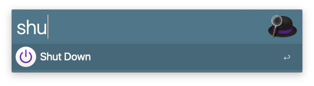

Today is your first day as front-end developer in this fancy company, Congrats!
They provided you with this shiny macbook pro full options, but there is one hiccup: you are a window user 👻.

Don't be scared, here is a short list of tips and tools to get you started in the right track!

## Applications

### XCode

Xcode is an IDE for the Mac ecosystem. You can use it to work, but this is not why we need it: it come with a bunch of packages that may be needed by other programs and provide some nice other tools, like the simulator that we will discover later. 
Don't waste time and start downloading [Xcode on App Store](https://apps.apple.com/us/app/xcode/id497799835?mt=12), as it will take some time (~13go, without optionals packages)

### Improving your terminal: iTerm2


This is obviously opinionated, and you have other options, but this is one of the most popular choice. 
Since we will spend some time in there for the rest of this article, we can deal with that now and get it from [iterm2.com](https://iterm2.com/index.html) or go directly to the next step. 

#### Pimp your shell

With `Catalina` and onward, macOS come with `zsh` instead of `bash`, so here you don't have to install anything. However, you could be interested in customizing it a little with the help of some plugins: [https://ohmyz.sh/](https://ohmyz.sh/)
For the adventurous, you could also give a try to [fish](https://fishshell.com/) and [oh-my-fish](https://github.com/oh-my-fish/oh-my-fish),but maybe not on the first day as it has few differences that could cause troubles while running some scripts if you don't pay attention. 

### Homebrew Package manager

Just like windows, macOS don't come with an actual package manager, you have to get it yourself.
Homebrew is the defacto standard for that, you can check their website [brew.sh](https://brew.sh/) or just run the following command:

```bash
/bin/bash -c "$(curl -fsSL https://raw.githubusercontent.com/Homebrew/install/HEAD/install.sh)"
```

Once it's done, you are all set to install the rest of the tools!

> If you are a Windows user, you might want to check `chocolatey` for the same purpose on your personal machine.

### NVM and nodejs

NVM is short for Node Version Manager: it let you easily switch node version between project and can even do it automatically when you open a project by using the configuration file `.nvmrc` that can be set at the root of your projects.

You can install it with the new brew command, but it is worth to mention that nvm dont officially support this installation options (if you have troubles, install it from the [official page](https://github.com/nvm-sh/nvm))

```shell
brew install nvm
```

> FYI: automatic switch won't work out of the box with `fish shell`

### Docker Desktop

I don't think I need to present this one, but here you go:
```shell 
brew install --cask docker
```
or from the official page [docker desktop](https://www.docker.com/products/docker-desktop)

### Tilling manager


I am a casual user of tilling manager. If you never heard about this topic before to you: they are small apps allowing us to organise the different windows on your desktop according to custom or predefined rules. Most of those actions and transitions can be enabled through keyboard shortcut, freeing us from tedious mouse manipulation for to get your perfect workspace ready.  If you are also interested, I can share 2 different one:

#### Rectangle
Nice and simple, it is a small and easy experience to start on this path. Work out of the box and still rely on pointer device to do most of the work.

Get it on their [website](https://rectangleapp.com/) or through brew.
 
 ```shell
 brew install --cask rectangle

 ```

> Windows has some option for that within the [PowerToys apps list](https://docs.microsoft.com/en-us/windows/powertoys/fancyzones), however it is most popular in linux ecosystem where solution like `i3` sometime completely replace traditional environment such as `Gnome` or `KDE`

#### Amethyst

All battery included, extensive configurable keyboard shortcut. You will most probably want to disable almost everything and gradually add your own shortcut.

Learn more on their [GitHub page](https://github.com/ianyh/Amethyst) or install it directly:

```shell
brew install --cask amethyst
```

### Browsers

If you have not played with your laptop already, you should only have Safari installed.

#### Safari Technology Preview

This is the Developer Edition of Safari. It includes a sneak-peak of upcoming features and some additional tools that will be necessary later.
You can get it from the official [Safari technology Preview](https://developer.apple.com/safari/technology-preview/) page.

```bash
  brew tap homebrew/homebrew-cask-versions
  brew install --cask safari-technology-preview
```

#### Firefox, Chrome, Edge and Brave

I suppose you use one of those as daily-driver and the others are always there for some debugging sessions!

```shell
brew install --cask firefox
brew install --cask microsoft-edge
brew install --cask google-chrome
brew install --cask brave-browser
```


### Debugging Tools

#### Iphone Simulator

Remember Xcode and Safari TP ? Now we will use them: 
Simulator is an application bundled with xcode.
You can use spotlight `cmd+space` or Alfred4 `option+space` to launch the simulator application:



Once the app is running, start a simulator via `file > Open Simulator > iOS 15.x > iPhone 12` or the appropriate pair for your use-case. For some older version, you may have to download the corresponding image.



When the device finished booting up, you can navigate to the page you want to test and see how it behaves on the smartphone.

It is already nice, but it is not over yet !

The final touch is connecting the developer tools of safari to your running simulator.
To do so, open `Safari Technology Preview` that we installed earlier and reach fo the `develop > <your simulator> > Safari - <your page>`. 


Here you go, you can now fix this nasty bug that your PM just hand you over! 

### Closing up

Feirabend!

Check if you have not forgotten to save some work on other `space` (virtual desktop) with `ctrl + right/left arrow`,
then lock your screen with `cmd + ctrl + q` or shutdown quickly using `Alfred4` productivity tool:



Next article could be about setting up a window VM running IE 11 on your Mac (sacrilege), because your company can't give up on all the old monkeys stuck in 2013! 
It is time for some quality time away from screens, see you next time !


