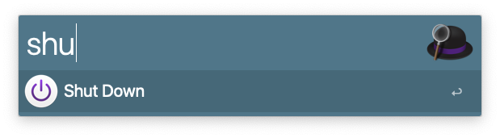

Today is your first day as a front-end developer in this fancy company, congrats!
They provided you with this shiny Macbook pro full options, but there is one hiccup: you are a Windows user 👻.

Don't be scared, here is a short list of tips and tools to get you started in the right track!

## Applications

### Xcode

Xcode is an IDE for the Mac ecosystem. You can use it to work, but this is not why we need it: it comes with a bunch of packages that may be needed by other programs and provides some nice other tools, like the simulator which we will discover later. 
Don't waste time and start downloading [Xcode on App Store](https://apps.apple.com/us/app/xcode/id497799835?mt=12), as it will take some time (~13go, without optionals packages)

### Improving your terminal: iTerm2


This is obviously subjective and you have other options, but this is one of the most popular choices. 
Since we will spend some time in there for the rest of this article, we can deal with it now and get it from [Iterm2.com](https://iterm2.com/index.html) or go straight to the next step. 

#### Pimp your shell

Since `Catalina` macOS comes with `zsh` instead of `bash`. So here you don't have to install anything. However, you could be interested in customizing it a little with the help of some plugins: [https://ohmyz.sh/](https://ohmyz.sh/)
For the adventurous, you could also give a try to [fish](https://fishshell.com/) and [oh-my-fish](https://github.com/oh-my-fish/oh-my-fish), but maybe not on the first day as it has few differences that could cause troubles while running some scripts - if you don't pay attention. 

### Homebrew package manager

Just like windows, macOS doesn't come with an actual package manager, you have to get it yourself.
Homebrew is the defacto standard for that. You can check their website [brew.sh](https://brew.sh/) or just run the following command:

```bash
/bin/bash -c "$(curl -fsSL https://raw.githubusercontent.com/Homebrew/install/HEAD/install.sh)"
```

Once it's done, you are all set to install the rest of the tools!

> If you are a Windows user, you might want to check `chocolatey` for the same purpose on your personal machine.

### NVM and Node.js

NVM is short for Node Version Manager: you can use it to easily switch the Node version between different projects and even do this automatically when you open a project by using the configuration file `.nvmrc`, which can be placed in the root directory of your projects.

You can install it with the new brew command, but it's worth to mention that NVM does not officially support these installation options (if you have problems, install it from the [official page](https://github.com/nvm-sh/nvm))

```shell
brew install nvm
```

> FYI: automatic switch won't work out of the box with `fish shell`. You can check this repo [jorgebucaran/nvm.fish](https://github.com/jorgebucaran/nvm.fish) for a fix.

### Docker Desktop

I don't think I need to present this one, but here it is:
```shell 
brew install --cask docker
```
or from the official page [docker desktop](https://www.docker.com/products/docker-desktop)

### Tilling manager


I am a casual user of tilling manager. In case you have never heard of this topic before: They are small apps that allow us to organise different windows on your desktop according to costumized or predefined rules. Most of these actions and transitions can be enabled via keyboard shortcuts, freeing us from tedious mouse manipulation to create the perfect workspace. If you are interested, I can share 2 different ones:

#### Rectangle
Nice and simple, it is a small and easy experience to start on this path. It works out of the box and still relies on the pointer device to do most of the work.

Get it on their [website](https://rectangleapp.com/) or via brew.
 
 ```shell
 brew install --cask rectangle

 ```

> Windows has some options for this in the [PowerToys apps list](https://docs.microsoft.com/en-us/windows/powertoys/fancyzones), but it is most popular in the Linux ecosystem, where solutions like `i3` sometimes completely replace traditional environments like `Gnome` or `KDE`.

#### Amethyst

It has many configurable keyboard shortcuts. You will most probably want to disable almost everything and gradually add your own shortcuts.

Learn more on their [GitHub page](https://github.com/ianyh/Amethyst) or install it directly:

```shell
brew install --cask amethyst
```
### Launcher: Alfred4
[Alfred](https://www.alfredapp.com/) is a launcher and command prompt. Its a bit like spotlight but faster and customizable. You invoke it with `option + space` and type what you want to do. It can be further improved by buying the *powerpack*, but the standard is already (subjectively) better than spotlight.

```sh
brew install --cask alfred
```

### Browsers

If you haven't played with your laptop yet, you should only have Safari installed.

#### Safari Technology Preview

This is the Developer Edition of Safari. It contains a sneak-peak of upcoming features and some additional tools that will be necessary later.
You can get it from the official [Safari technology Preview](https://developer.apple.com/safari/technology-preview/) page.

```bash
  brew tap homebrew/homebrew-cask-versions
  brew install --cask safari-technology-preview
```

#### Firefox, Chrome, Edge and Brave

I suppose you use one of them as a daily-driver and the others are always there for some debugging sessions!

```shell
brew install --cask firefox
brew install --cask microsoft-edge
brew install --cask google-chrome
brew install --cask brave-browser
```


### Debugging Tools

#### Iphone Simulator

Remember Xcode and Safari TP ? Now we are going to use them: 
Simulator is an application that is bundled with Xcode.
You can use Spotlight with `cmd+space` or Alfred4 with `option+space` to launch the simulator application:


Once the app is running, start a simulator via `file > Open Simulator > iOS 15.x > iPhone 12` or the appropriate pair for your use case. For some older versions, you may need to download the corresponding image.


When the device has finished booting up, you can navigate to the page you want to test and see how it behaves on the smartphone.

It's already nice, but it's not over yet !

The final touch is to connect Safari's developer tools to your running simulator.
To do so, open `Safari Technology Preview` which we installed earlier, and go to the menu: `develop > <your simulator> > Safari - <your page>`. 


Here you go, now you can fix this nasty bug that your PM just handed you! 

### Closing up

Feierabend!

Check if you have not forgotten to save some work on other `spaces` (virtual desktop) with `ctrl + right/left arrow`,
then lock your screen with `cmd + ctrl + q` or shut it down quickly with the productivity tool `Alfred4`:



The next article might be about setting up a Windows VM running IE 11 on your Mac (sacrilege), because your company can't give up on all the old monkeys stuck in 2013! 
It's time for some quality time away from screen, see you next time !


