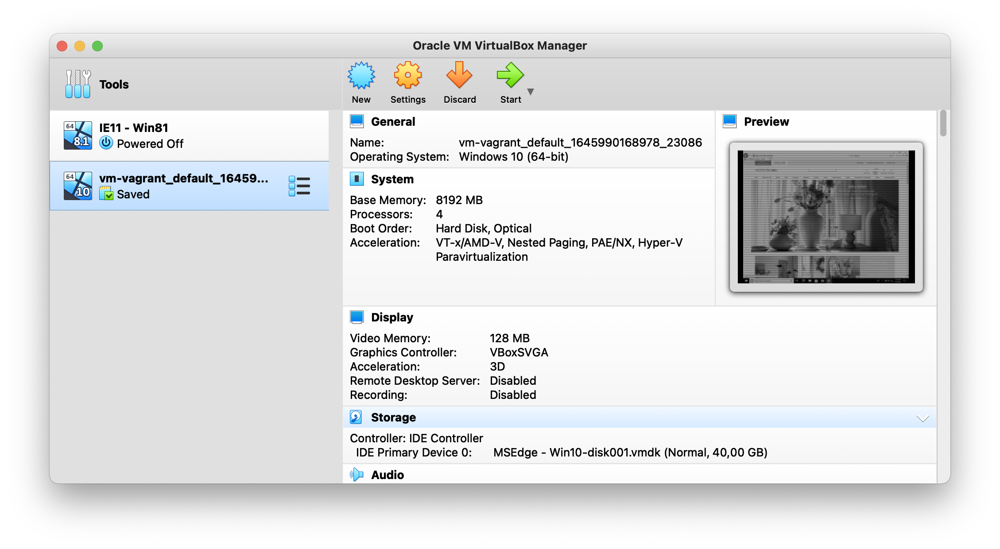
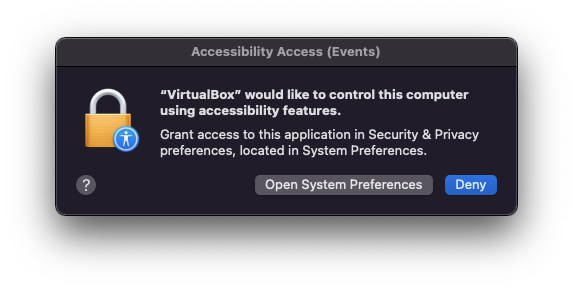
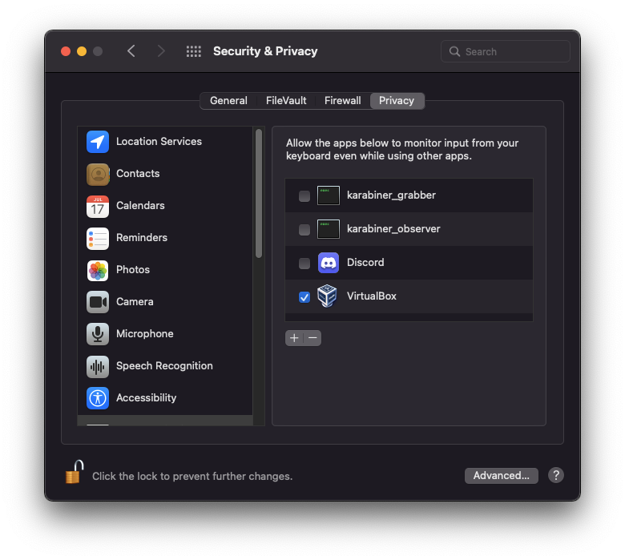
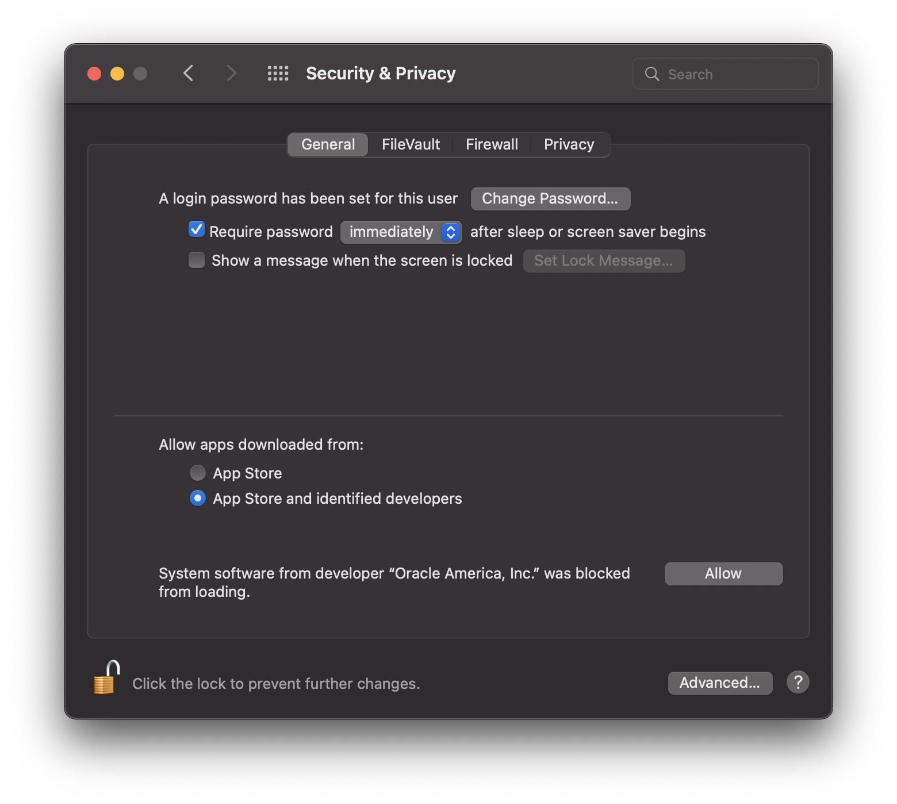
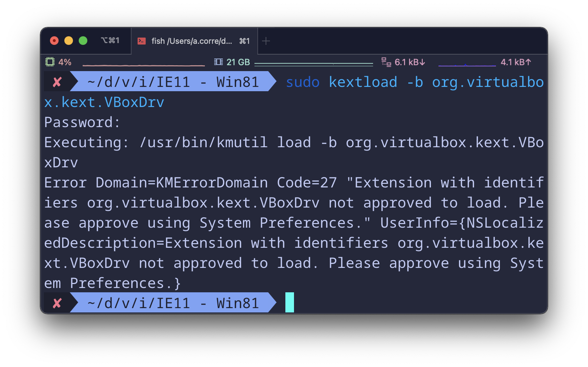
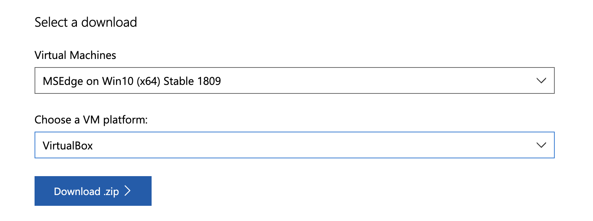
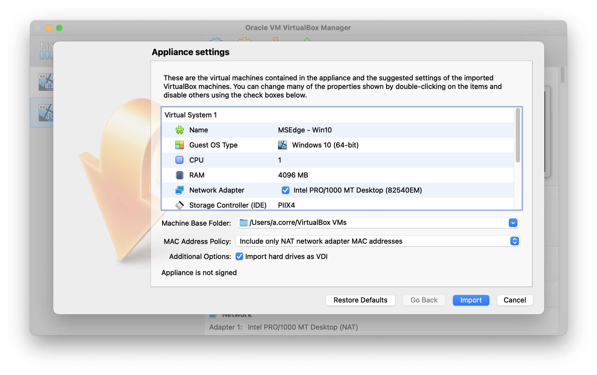
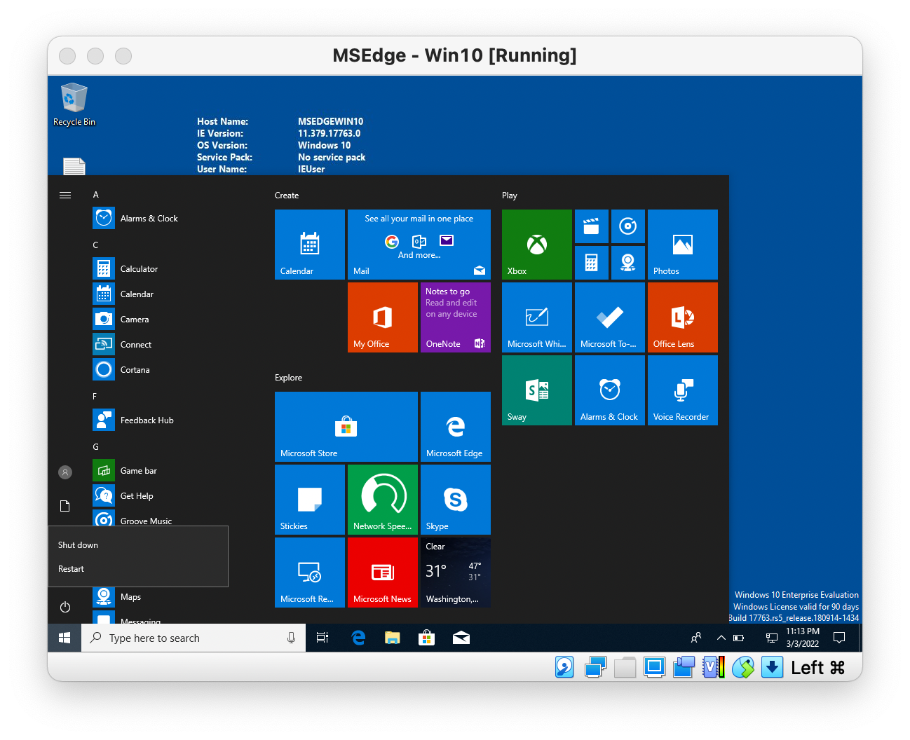

Virtual Machines are an important tool for any developer that need to test quickly on different environments. 
Nowadays, for on the front-end area, they are often overlooked in favor of testing tool such as browserstack. It is true that in most case, these type of services provide a simpler way to test your work, especially when we consider mobile devices.
However, online services have their own limitations such as network quality, pricing, latency, I/O, concurrent sessions...

## VM manager / virtualization software
This is where you store your images, configs and get the environment running.
You have several choices, some of them free.

> You may see `Vagrant` mentioned sometime, it is more an orchestrator than a fully fledged virtualization app. It let you work with several one through *BOX*  (packaged config files) and provide an unified CLI


You have more that one option here, but we will go with [Virtualbox](https://www.virtualbox.org/).

In additions of the official link above, you can also use brew:
```shell
# https://formulae.brew.sh/cask/virtualbox#default
brew install --cask virtualbox
```

On first launch, you will have to give a few authorisations about security and accessibility features. Unfortunately, it may be silenced somehow.





Right after starting the application or failing to add an image, check the security setting panel for the message shown in the picture bellow:


This message is know for disappearing after some time. if you dont see it but still experience problems, you can run the following command:
```shell
sudo kextload -b org.virtualbox.kext.VBoxDrv
```
You should get a similar output as the following picture and the message with the allow button should be visible again in the security settings panel.  



Now we are ready for some inception!

## Getting the VM

Microsoft in their magnanimity provide a [collection of VM](https://developer.microsoft.com/en-us/microsoft-edge/tools/vms/) for virtualization solution.
Select the version and provider you want, and start the download. In our case we are looking for Windows 10 with MSEdge **(also include IE11)**.

> It is not a light download, so log of any VPN you might be using !



Once the download is done, you will have to extract the VM from the zip. 

> On MacOS you can screw that up with the normal archive manager app:
> 
>  **"Mac users will need to use a tool that supports zip64, like The Unarchiver, to unzip the files."**

However, you don't have to download anything, you can directly use the CLI:

```shell
unzip MSEdge.Win10.VirtualBox.zip
# Archive:  MSEdge.Win10.VirtualBox.zip
#  inflating: MSEdge - Win10.ova
```

Open the `MSEdge - Win10.ova` file and you should be presented with a virtualbox prompt for importing the VM with included config




Once imported, you can start it and start playing arround!



You may want to update a bit your config, to have a smoother experience:
here is my current changes

- Video memory up to at least 64mb (or 128mb with 3D acceleration)
- Graphic driver switched to VBoxSVGA
- CPU Core up to 2 or 4


